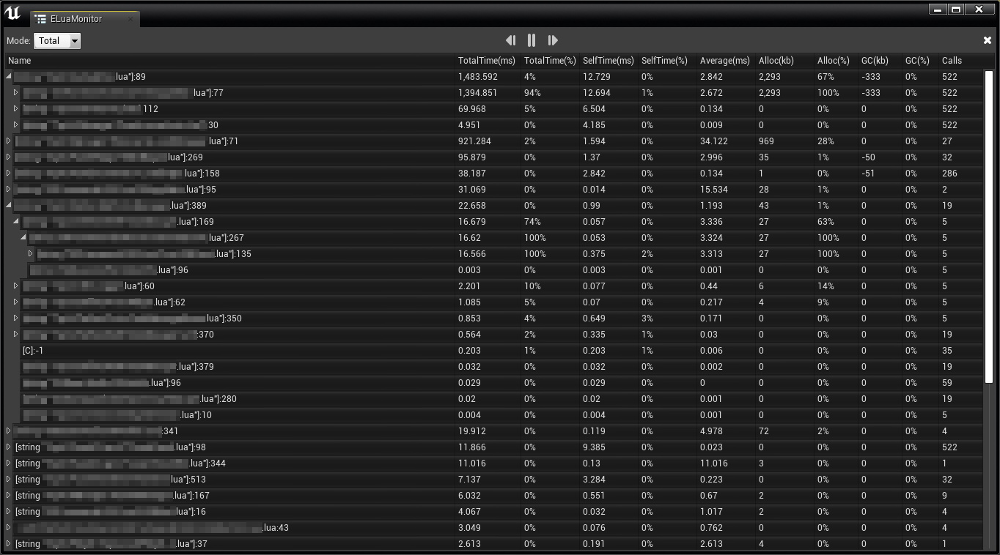

# ELuaProfiler
Easy LuaProfiler
## Supported Solutions
| Solution | Supported |
| ---      | ---       |
| *unlua-ue4* | √ |
| *slua-ue4* | × |
| *slua-unity* | × |
## Build
### UE4
1. configure Setup.bat/Setup.command
    - ```
      set src=E:\repo\ELuaProfiler\UE4\UnLua\
      set dst=E:\YourProject\Plugins\
      ```
2. Run Setup.bat/Setup.command
3. Build YourProject
## Usage
### ELuaMonitor
ELuaMonitor主要用于剖析Lua的CPU性能，以及内存频繁开辟引起GC的问题，编辑器界面如图：

#### MonitorMode
右上角为模式选择控件，目前支持三种模式
1. PerFrame
    - 逐帧采样，并且可以按帧数前后回溯
2. Total
    - 累计采样，统计一段时间内的开销情况，最常用。
3. Statistics
    - 统计模式，在Total的基础上将所有节点平铺开，统计单函数的开销。
#### MonitorController
1. Play
    - 中间的按钮为Play，点击Play后，如果LuaVM启动了，会立刻开始Profile。否则等待LuaVM启动，自动开始Profiler
    - 开始Profile后按钮变为暂停键，可以暂停和恢复Profile
2. Clear
    - 最右侧为Clear按钮，点击Clear后会立刻停止Profile，并清空当前Profile数据
3. NextFrame/PrevFrame
    - 暂不支持PerFrame
    - 后续会用作逐帧回溯
#### MonitorData
1. TotalTIme(ms)
    - 函数从Call到Return总共消耗的时间，单位为毫秒
    - 该值会受Profiler本身开销影响，主要是Profiler取Time的开销（因为Profiler取Time必须是同步的，但比如自增函数的开销比取Time开销还小，势必会造成误差，可以控制ProfileDepth来消除）
2. TotalTime(%)
    - 该函数调用时间开销占父节点的百分比
    - 第一级节点的父节点为Root，由于Root只有CallTime，而没有Return(除非结束LuaVM)。所以Root.TotalTime代表着Profile了多久
    - 所以这个值一定程度上也可以视为该一级节点占整个游戏的比重
    - TotalTime / Parent.TotalTime
3. SelfTime(ms)
    - 代表该函数自身的开销
    - TotalTime减去各子节点的TotalTime
4. SelfTime(%)
    - 自身开销占父节点的比重
    - SelfTime / Parent.SelfTime
5. Average(ms)
    - 平均每次调用耗时
    - TotalTime / Calls
6. Alloc(kb)
    - 函数调用期间开辟的内存，单位为kb
7. Alloc(%)
    - 该函数开辟的内存占父节点的比重
    - Alloc / Parent.Alloc
8. GC(kb)
    - 函数调用期间释放的内存，因为Lua的GC为步进式，所以不能准确形容当前函数释放的内存。
    - 但一级节点的Alloc - GC可以作为整个Lua的内存增量，可以用来观察代码是否有明显泄露，但具体定位还应该使用ELuaMemAnalyzer。
9. GC(%)
    - 该函数调用期间发生的GC占父节点的比重
    - GC / Parent.GC
10. Calls
    - 该函数被调用次数
## Roadmap
### 1. ELuaMemAnalyzer
为ELuaMemAnalyzer编写EditorUI界面
### 2. Support slua-ue4
接入slua-ue4
### 3. Remote Profile
将ELuaProfiler分为Server和Client，支持真机远程Profile
### 4. Support slua-unity
接入slua-unity，并编写Unity版本的EditorUI
### 5. Support unlua-unity
接入unlua-unity
### 6. support xlua-unity
接入xulua-unity
